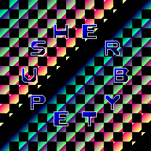
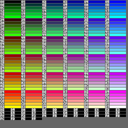

# ByteRusther
This repository contains a small implementation of the vm [BytePysher](https://esolangs.org/wiki/BytePusher) created by the user [Javamannen](https://esolangs.org/wiki/User:Javamannen).

## Features
BytePusher is:

- **Simple:** BytePusher takes minimalism to the extreme. A complete VM including graphics and sound can be written in less than 100 lines of C code.
- **Cross-platform:** BytePusher's simple structure makes it very easy to write a VM for any OS (or even without an OS). It would also be simple to implement in actual hardware. All programs run cycle-identical and bit-identical across all platforms.
- Persistent: The complete machine state can be saved to a file, and later be reproduced exactly.
- **Fixed-size:** BytePusher's memory size, screen resolution and keyboard layout are fixed.
Fixed-speed: BytePusher is specified as a realtime system with fixed framerate, CPU speed and audio rate. It executes a fixed number of instructions per frame, which means that a BytePusher program can't "hog" the host CPU.
- **100% sandboxed:** A BytePusher VM has its own fixed-size _"sandbox"_ memory, which it can never read or write outside of.

## How to run
You can just checkout the code and build it using _cargo_.

```
cargo build --release
```

and then run it giving it any of the roms in the `rom` folder.

```
./target/release/byte_rusther roms/nyan.bp
```

Should display the animated image below.
<p align="center">
    
</p>

<br>
<br>
<br>
Other example roms:

<p align="center">
    
</p>
<br>
<br>
<br>
<p align="center">
    
</p>
